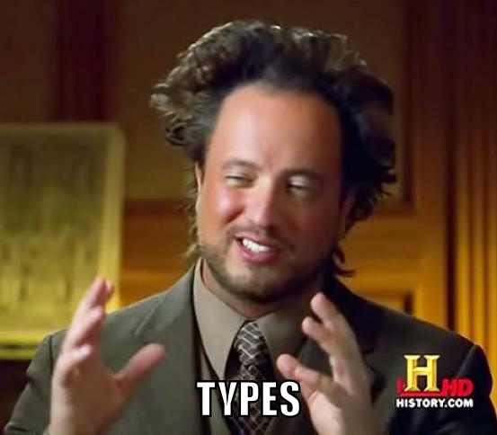

build-lists: true

# [fit] _Correct Behavior_
## through
# [fit] _Type Safety_

^ I want to talk today about some of the great things we can do with the new and improved type system that Swift brings to Cocoa development. For those used to the dynamic nature of Objective-C, Swift might seem like a setback—more akin to Java than the language we were using before.

^ However, I believe that Swift’s type system brings some much-needed safety to Cocoa development, helping us catch more bugs at compile-time, before they ship to and affect real users.

^ Specifically, static types allow us to _prove_ the correctness of certain things, and prevent many invalid states from even occurring. This talk will demonstrate some of the techniques for doing that, and show why testing alone isn't good enough.

---

# [fit] _@jspahrsummers_

## ReactiveCocoa
## Mantle
## Carthage

^ First, let me introduce myself. My name is Justin Spahr-Summers (@jspahrsummers on GitHub, Twitter, basically everything), and these are some of the open source projects I’ve been involved with.

^ When I'm not doing Cocoa development, I like to spend time with functional programming languages like Haskell, Idris, or Elm, which I've found really helpful for expanding my mind and learning powerful new concepts.

---



^ So, what are types useful for? Why do we have type systems at all?

---

# [fit] Types _prevent errors_
# [fit] **(by restricting what you can do)**

^ These restrictions help catch errors at compile-time. Here are some common examples…

---

# `NSArray`
# [fit] is _more restricted_ than
# [fit] `NSMutableArray`

^ The type of `NSArray` prevents you from mutating it.

---

# `NSArray`
# [fit] _prevents more errors_ than
# [fit] `NSMutableArray`

^ Mutation introduces a whole new category of possible mistakes, like race conditions, inconsistent indices, etc.

^ Using `NSArray` instead of `NSMutableArray` will prevent many of those errors, through the type system alone.

---

# [fit] `Optional<T>`
# [fit] _restricts_ access to its value
# [fit] _prevents_ mistakes with `nil`

^ By forcing your code to acknowledge the possibility of `nil`, the `Optional` type in Swift helps prevent _accidental_ uses of `nil` values.

---

# `Array<T>`
# [fit] _restricts_ insertions
# [fit] _prevents_ crashes after retrieval

^ By forcing all elements to be the same type, `Array` prevents type mismatch errors that can result in exceptions and crashes.

^ Now, the compiler can verify that the code writing the array and the code reading the array agree upon what type of value they should be using.

---

# **More generally…**

---

# [fit] _Types_ = _Proofs_
# [fit] **(the [Curry–Howard correspondence](http://en.wikipedia.org/wiki/Curry–Howard_correspondence))**

^ A well-typed program is also a logical proof, and any logical proof can be represented as a program.

^ Practically, this equivalence means (in a programming language with a type system) that each function must _prove_ its correctness to the typechecker and the compiler.

---

# A _→_ B

^ For example, in order for a function from type A to type B to compile, you must _prove_ that such a transformation is valid. This "proof" consists of writing a well-typed function definition.

---

# A _→_ B

```swift
func toInteger(num: Double) -> Int {
    let result = round(num)
    return Int(result)
}
```

^ Here's a function from `Double` to `Int`. The integer result _proves_ that we don't have a fractional component anymore.

^ There are a few valid implementations for this type signature. I picked the `round` function, but `floor` and `ceil` would also work. In all cases, though, executing the function gives you a _provably integral_ value as a result.

---

# [fit] String _→_ String

^ By contrast, the amount we can prove with this function is very little. You still have to prove that you have a `String` result, but there innumerable ways to implement this function that may be incorrect, or may not do anything at all!

---

# String _→_ String

```swift
func identity(s: String) -> String {
    return s
}
```

^ Here's a perfectly valid proof for the aforementioned type signature. This is a function from `String` to `String`, but we don't get much useful information from it.

---

# [fit] We can use
# _types_
# [fit] to prove
# _correctness_

^ The correspondence between types and proofs is useful because it means that having an instance of a given type _proves_ that you have performed a logically valid transformation to obtain it.

---

# [fit] What does _NSData_ prove?
### **(Not much.)**

^ When you have a value of type `NSData`, what can you say about it? Basically nothing, except perhaps that it has a certain length.

^ You just have a bundle of bytes, and that tells you very little.

---

# [fit] What does _NSString_ prove?
### **_Characters_, not just bytes!**

^ On the other hand, having a value of type `NSString` proves that you have "characters," not just a bundle of bytes.

---

# [fit] What does _NSURL_ prove?
### **_Valid URL_, not just a string!**

^ Taking it one level further, a value of type `NSURL` proves that you have a valid URL, not just any arbitrary string.

---

# [fit] Extends to
# _any kind_
# [fit] of validation

^ For example, JSON parsing means validating that a raw string contains some data structures, then validating that those data structures can be converted into your program's model objects.

---

# [fit] **What about _tests_?**

^ I imagine that at least some of you are wondering why I couldn't be doing all of this with tests instead of types.

^ Although tests can certainly _help_ improve correctness, they're not a complete replacement for powerful types.

---

# [fit] **Science break!**


^ In scientific research, hypotheses can never be _proven_—they can only be supported by the available evidence, or else disproven if the evidence is contradictory.

^ Tests have a similar issue.

---

# [fit] _Tests_ are _support_
# [fit] _Types_ are _proof_

^ Fundamentally, a passing test is merely _one piece_ of evidence that your behavior is correct. Although a test can _disprove_ correctness by failing, it can never _prove_ it by succeeding. It's just supporting material.

^ On the other hand, types actually _are_ proof, by the Curry-Howard correspondence/equivalence I mentioned earlier. Whatever assertions you have encoded into your program's types will be proven or disproven by the typechecker.

---

# **_Caveats_**

- Proofs can contain errors too
- Types can’t represent everything
- Tests may be _good enough_

^ Although significantly less likely, it's possible to make errors when describing types in your program, much like making an error in a logical proof. The compiler should catch accidental mistakes, but it can't fix an incorrect-but-valid specification.

^ Types, and Swift's type system in particular, also can't capture everything. Side effects are especially nefarious—for example, it's impossible to tell (from just the types) whether invoking the same function multiple times will yield the same result.

^ Finally, tests might be good enough for your use case. For example, it's far easier to test that something can be loaded from your app bundle than it is to somehow encode that in the type system. (I don't even know what that would look like.)

---


^ There's even more you can do with types that you may not have expected.

---

# _Phantom_ types[^1]

```swift
struct FileHandle<A> {
    let handle: NSFileHandle
}

enum Read {}
enum Write {}

func openForReading(path: String) -> FileHandle<Read>
func openForWriting(path: String) -> FileHandle<Write>
func readDataToEndOfFile(handle: FileHandle<Read>) -> NSData
```

[^1]: See [functional snippet #13](http://www.objc.io/snippets/13.html) from [objc.io](http://www.objc.io).

^ This is an example I really like, from the authors of objc.io and Functional Programming in Swift.

^ Here, we've created a wrapper for NSFileHandle that we parameterize over a phantom type `A`. It's called a "phantom" type because we never actually use it in the implementation of the `struct`.

^ Even though it's never referenced, we can still use that parameter for typechecking. Here, `Read` and `Write` are used to indicate file handles for reading or writing, respectively. Consequently, a given handle can only be passed to functions that match its access type.

---

# **Case study:**
# [fit] Errors in ReactiveCocoa

^ I'd also like to share a more in-depth example of using types in a somewhat unconventional way to prevent errors.

^ This one comes from ReactiveCocoa (RAC), which is a library (that I contribute to) for functional reactive programming, using streams of events known as “signals.”

---

# Signals consist of…

- Any number of _next_ events
- Optionally an _error_ or _completed_ event

## `Next* (Error | Completed)?`

^ In RAC, signals must obey this grammar.

---

# [fit] `RACSignal *`

^ This is the type of a signal in Objective-C.

---


^ Since signals are just an opaque object pointer in Objective-C, there's no way to tell which events it may send, or what type of value will be associated with the `next` events.

---

# Property binding in RAC 2

```objc
RAC(self.imageView, image) = [RACObserve(self, model)
    flattenMap:^ RACSignal * (Model *model) {
        return [model fetchImage];
    }];
```

^ This is a simple example of using RAC to bind an image view.

^ Here, we’re saying: whenever the model is replaced, fetch a new image (from the network or a database, perhaps), and set it upon the image view.

---

# Property binding in RAC 2

```objc
RAC(self.imageView, image) = [RACObserve(self, model)
    flattenMap:^ RACSignal * (Model *model) {
        return [model fetchImage];
    }];
```

```
*** Received error from RACSignal in binding for key
path "image" on UIImageView:
    Error Domain=NSURLErrorDomain Code=-1 "Operation
could not be completed."
```

^ Unfortunately, this example isn't particularly safe if the -fetchImage signal can send an error event. Since we don't do anything to handle an error here, it would reach the property binding and trigger an assertion failure.

^ RAC (the framework) can't really know what the right answer is for your program here. Ignoring the error could be dangerous, but silently failing could be bad too. So it trips an assertion.

---

# **Solution:**
# [fit] Types!

^ Now that we can use Swift, this problem can be avoided by capturing more
information in the type system.

---

# [fit] `Signal<T, Error>`

^ This is the new signal type in ReactiveCocoa 3. Signals are now parameterized by the type of values they send (`T`), _as well as_ the type of error they might send (`Error`).

^ Okay, so now we can know what kind of error is sent. How does that help us with the property binding example?

---

# [fit] `enum NoError {}`

^ The answer lies in this `NoError` type we introduced as well. This type doesn't have any constructors, so you can never actually have an _instance_ of `NoError`—you can only refer to the type itself.

^ When used as part of a signal's type, `NoError` guarantees that it can never send an error event, because that event would be impossible to instantiate using this type!

---

# Property binding in RAC 3

```swift
func <~ <T> (property: MutableProperty<T>,
    signal: Signal<T, NoError>)

func <~ <T> (property: MutableProperty<T>,
    producer: SignalProducer<T, NoError>)
```

^ In RAC 3, we use this squiggly operator to bind to properties. You can see here that it requires a signal or a signal producer which _must not error_ (because of the presence of `NoError`).

^ Don't worry about the introduction of "signal producers" here. They're not super relevant to the error handling bits.

---

# Property binding in RAC 3

```swift
class Model {
    func fetchImage() -> SignalProducer<UIImage, NSError>
}

self.imageProperty <~ self.modelProperty.producer
    // TYPE ERROR: NSError is incompatible with NoError
    |> flatMap(.Latest) { model in
        return model.fetchImage()
    }
```

^ A naive reimplementation of the Objective-C binding might look like this, using the RAC 3 APIs.

^ However, instead of asserting at runtime like the Objective-C version, this will fail at compile-time with a type error. Specifically, `fetchImage` returns a signal producer which may send `NSError`, but the property is expecting one which cannot error (i.e., `NoError`).

---

# Property binding in RAC 3

```swift
class Model {
    func fetchImage() -> SignalProducer<UIImage, NSError>
}

self.imageProperty <~ self.modelProperty.producer
    |> flatMap(.Latest) { model in
        return model.fetchImage()
            // Ignore any error event
            |> catch { error in .empty }
    }
```

^ In order to appease the compiler, we're forced to choose how errors should be handled. Here, we've chosen to ignore them, but there are other options too.

^ And, just like that, we've added additional safety to these APIs by including more information in the type system. Users are now required to _prove_ that errors behave in a certain way. Awesome!

---

# _Types_
# [fit] can also describe
# _effects_

^ In addition to adding safety, types can also describe some form of _unsafety_, like side effects.

---

# _`IO`_
#### ~~monad~~
# in Haskell

^ One of the more famous examples of this is the IO *cough*monad*cough* in Haskell. (We're not gonna talk about monads.)

---

# With _IO_, you can…

- Put a value into it
- Perform side effects using the value
- “Lift” pure functions to apply to the value
- Never[^2] get the result back out

[^2]: Except through the rarely-used `unsafePerformIO`.

^ In other words, seeing IO is a strong suggestion of side effects. And if you _don't_ see IO, you even have proof that there _aren't_ side effects, since the IO would still be there if that were the case!

^ This is similar to Swift's `Optional`, which suggests that a value _might_ not exist. On the other hand, if you _don't_ see `Optional`, the value definitely _does_ exist.

^ So although `IO` doesn't need to exist in Swift, the concepts are still applicable.

---

# [fit] RAC 3 (again)

`Signal` and `SignalProducer` describe _effects over time_

- You can put values into it
- You can do time-based operations with the values in it
- To get the values out, you have to register for delivery—you don't get them right away†

---

# **Example:**
# [fit] Types for concurrency

^ I'd like to finish with one last example, of using types to describe concurrency.

---

# The UI Problem™

```swift
dispatch_async(someBackgroundQueue) {
    // Oops!
    self.textField.text = "foobar"
}
```

^ This is really contrived code, of course, but I'm sure we've all written code that accidentally did some UI work on a background thread.

^ What if we had some way to prevent this sort of thing from happening?

---

# Capturing UI code in the type system

```swift
struct UIAction<T> {
    init(_ action: () -> T)

    func enqueue()
    func enqueue(handler: T -> ())

    func map<U>(f: T -> U) -> UIAction<U>
    func flatMap<U>(f: T -> UIAction<U>) -> UIAction<U>
}
```

^ Introducing `UIAction`. This simple type will represent some arbitrary action that needs to be performed on the main thread.

^ We can instantiate it with any unit of work, compose any additional work using `map` and `flatMap`, then eventually enqueue that combined chunk of work on the main thread.

^ Notice how the type forbids executing the action in any way other than running it on the main thread. By wrapping UI effects into this type, we can guarantee that those effects _must_ be applied only while on the main thread!

---

# What if…?

```swift
extension UITextField {
    /// Sets the receiver's text to the given string
    /// when the returned action is executed.
    func jss_setText(text: String) -> UIAction<()>
}
```

^ We could use our new type in some UIKit extensions, like this one on `UITextField` that allows you to _safely_ set the text of a text field.

^ Imagine if all of AppKit or UIKit were written this way, officially. It'd become impossible to accidentally use them on a background thread! More powerful types can prevent all kinds of errors.

---

# Thanks

to all the lovely reviewers of this presentation: John Doe, Jane Doe, ???

---

# Questions?
